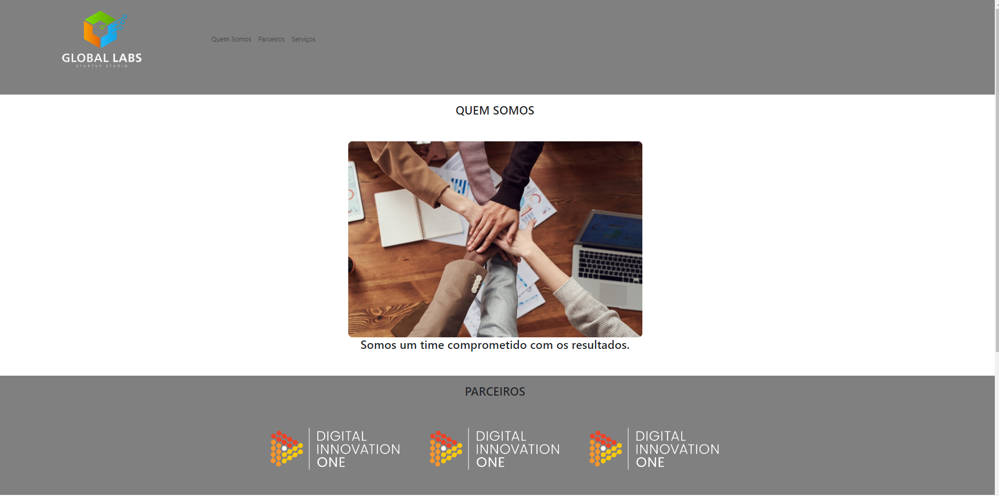

  

## 🚀 Tecnologias

Esse projeto foi desenvolvido com as seguintes tecnologias:

- HTML
- CSS
- Bootstrap
- JavaScript

## 💻 Projeto

Este projeto tem como finalidade treinar e colocar em prática as tecnlogias acima citadas. Habilidades adquiridas no bootcamp de desenvolvimento web na plataforma [Dio.me](https://www.dio.me/)  🚀💻
